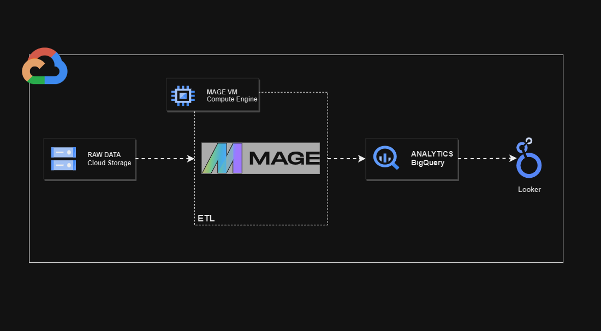
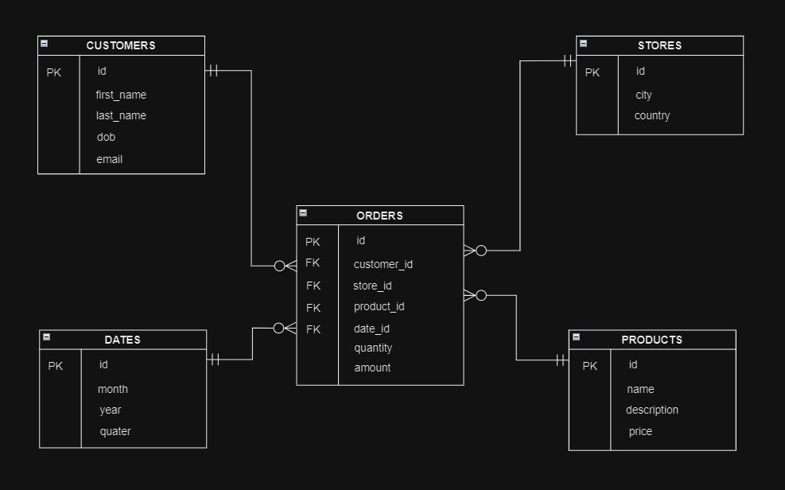
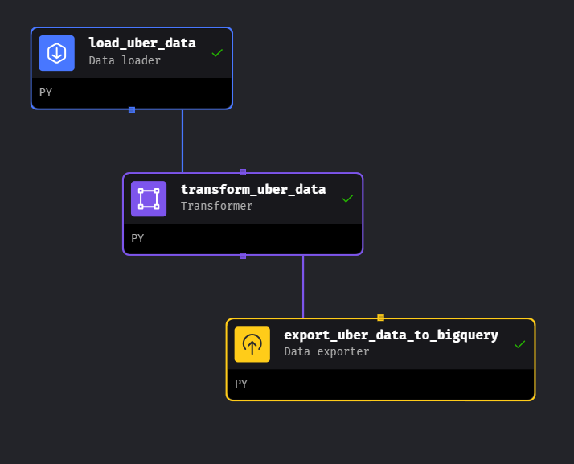

# Uber Data Analytics Project

## Overview

This project aims to extract valuable insights from Uber data through a comprehensive data analytics pipeline.
It leverages a range of GCP technologies, including Storage, Compute Engine, Mage, BigQuery, and Looker Studio.

## System Architecture

Key Components:

- GCP Storage: Repository for storing raw Uber data.
- Compute Engine VM: Hosts the Mage data pipeline tool.
- Mage: Orchestrates the ETL (Extract, Transform, Load) process.
- BigQuery: Scalable cloud data warehouse for storing transformed data.
- Looker Studio: Business intelligence tool for creating data visualizations and dashboards.

Data Flow:

- Raw data is uploaded to GCP Storage.
- Mage, running on the Compute Engine VM, initiates the ETL pipeline.
- Data is extracted from GCP Storage, undergoes necessary transformations, and is loaded into BigQuery for analysis.
- Looker Studio connects to BigQuery to build visualizations and dashboards, enabling data exploration and insights.

## Data Model

Key Tables:

- Fact Table: Stores core quantitative metrics of Uber trips, including foreign keys to dimension tables.
- Dimension Tables: Provide descriptive context for the fact table, including:
    - datetime_dim
    - passenger_count_dim
    - trip_distance_dim
    - rate_code_dim
    - payment_type_dim
    - pickup_location_dim
    - drop_off_location_dim

Key Tables and Relationships:

- Customers Table: Stores customer information (id, name, email, etc.)
- Orders Table: Records order details (id, customer_id, product_id, quantity, amount)
- Stores Table: Stores store information (id, city, country)
- Products Table: Stores product information (id, name, price)
- Dates Table: Stores date information (id, month, year, quarter) for date-related analysis.

## Data Pipeline

Mage orchestrates the ETL process, handling data extraction, transformation, and loading into BigQuery.

## Data Visualization

Key Visualizations:

- Matrix: Enables quick comparisons and pattern identification across multiple dimensions.
- Graphs: Visualize trends and relationships in the data, including:
- Average fare amount per payment type
- Total trips and revenue over time
- Trip duration and distance distributions
- Geographic distribution of passenger pickup and drop-off locations